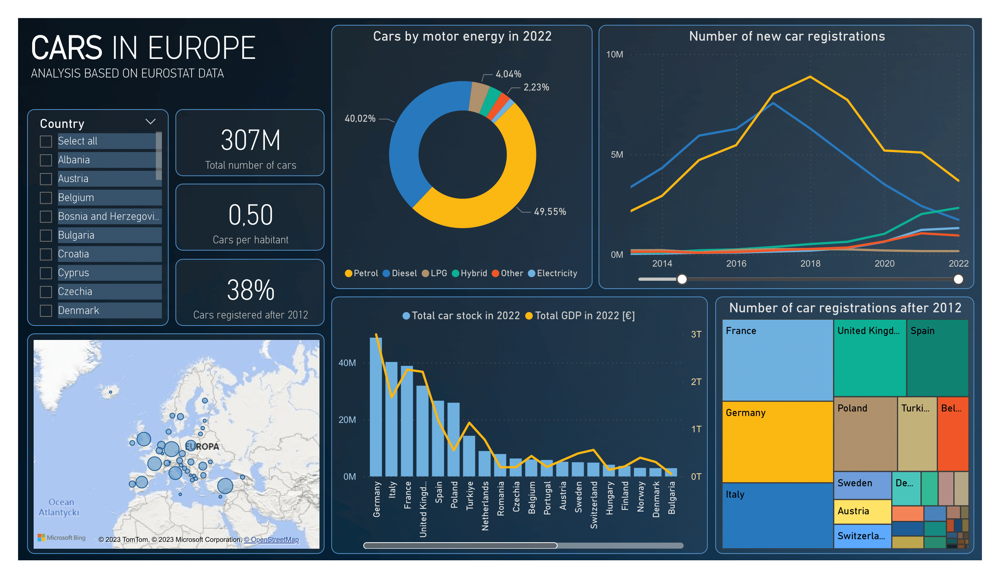

# Eurostat cars data - Analytical project

## Overview

This project's aim was to download, transform and visualize the data on passenger cars in european countries in recent years. 
Main factors taken into acount were: new cars registrations in each year, total car stock, cars motor energy type, countries population and GDP per capita.
All the used data can be found on the Eurostat website (https://ec.europa.eu/eurostat/data/database).
The repository contains:
 - ### eurostat_cars.ipynb
   Jupyter notebook with data processing with Pandas
 - ### new_cars.csv, cars.csv, population.csv, gdp.csv
   csv files generated for visualization
 - ### eurostat_cars_dashboard.pbix
   PowerBI dashboard

## Data

Downloaded datasets:
- Total car stock by country and motor energy type between 2013 and 2022
- New car registrations by country and motor energy type between 2013 and 2022
- Population by country between 1960 and 2022
- GDP per capita by country between 2000 and 2022
- Country codes
Important remarks:
- Data completeness varies - not every country has full data defined for every year - such cases were ignored
- Some of the data is not certain - a few records were marked as 'estimated' or 'break in time series' - such cases were treated as any other

## Dashboard

